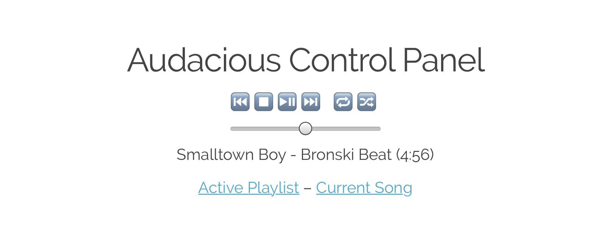

# spork

**spork** is a web-based audacious media player control panel.



To use **spork** you'll need a working [Go](https://golang.org/)
installation. Follow the instructions at
[golang.org](https://golang.org/doc/install) to install it. With a working
Go installation, **spork** can be installed by running the following on the
command line:

```bash
go get go.tmthrgd.dev/spork
```

Once installed, simply run the **spork** binary and navigate to
<http://localhost:8080>:

```bash
spork [-port=<port>]
```

## License

Unless otherwise noted, the spork source files are distributed under the
Modified BSD License found in the LICENSE file.
